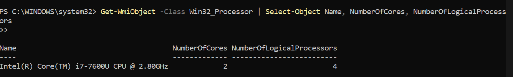
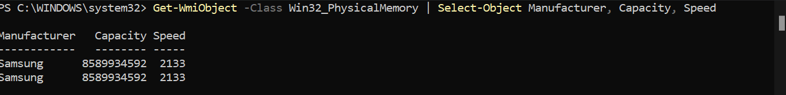

# KN01 - 15.11.2024

## DoD

- [ ] Sie machen die ersten Schritte Virtualisierung
- [ ] Sie lernen die Grenzen der Virtualisierung kennen

## A) Hypervisor Typ 1 und 2 (30%)

**Abgabe:**

**1. Was ist ein Hypervisor?**

Der Hypervisor verwaltet virtuelle Maschinen und teilt Hardware Resource zwischen mehreren Betriebssystemen.

**2. Was ist der Unterschied zwischen Typ 1 und 2?**

- Hypervisor 1 Bare-Metal Hypervisor:
  - Läuft direkt auf der Hardware.
  - Höhere Performance und Effizienz.

- Hypervisor 2: Läuft auf einem Host OS und ist von diesem abhängig.

  - Einfach zum Aufsetzen aber minimal niedrigere Performance

## B) Virtualisierungssoftware (70%)

**1. Vermutung des Typs**

- Typ 2, denn Virtualbox läuft auf meinem Windows 11 System, welches als Host OS dient.

**2. VM (Virtualbox)**

**2.1. Logische Prozessoren und RAM auf Host-System**

**CPU des Host-Systems**

  

**RAM des Host-Systems**

  

**2.2 VM aufsetzen**
Wir benutzen Oracles Virtualbox mit einem Ubuntu Linux System.

**2.3 Host-OS überladen (CPU)**

**2.4 Host-OS überladen (RAM)**

**3. Fazit Vermutung**