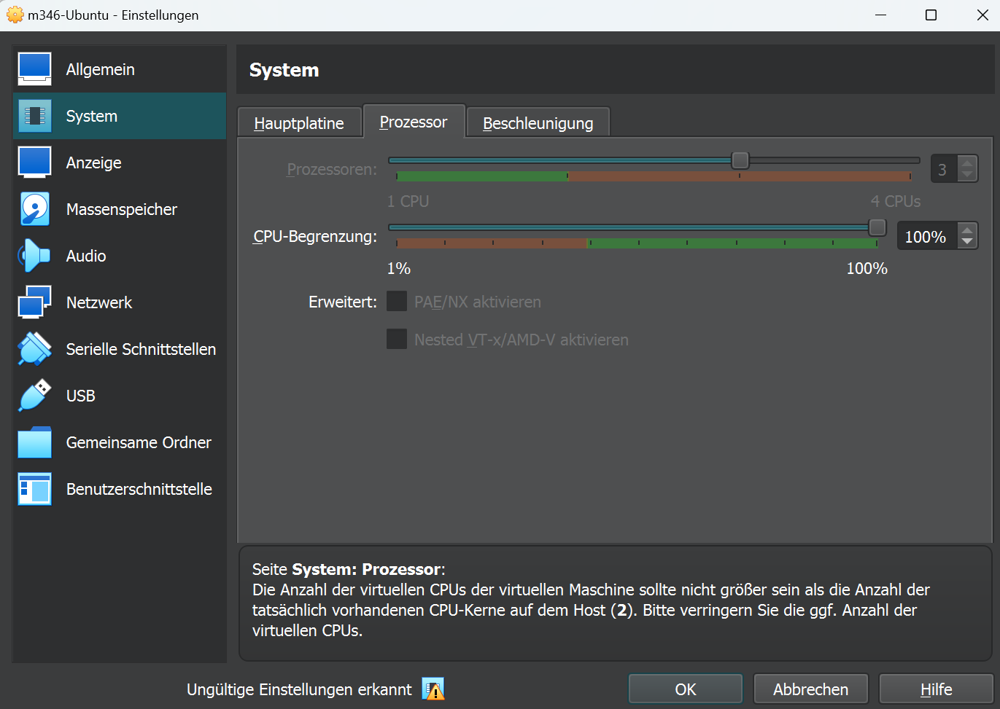
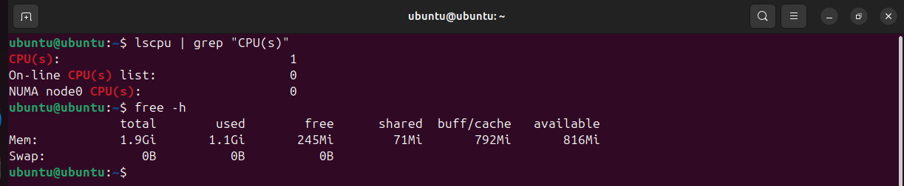

# KN01 - 15.11.2024

## DoD

- [x] Sie machen die ersten Schritte Virtualisierung
- [x] Sie lernen die Grenzen der Virtualisierung kennen

## A) Hypervisor Typ 1 und 2 (30%)

**Abgabe:**

**1. Was ist ein Hypervisor?**

Der Hypervisor verwaltet virtuelle Maschinen und teilt Hardware Resource zwischen mehreren Betriebssystemen.

**2. Was ist der Unterschied zwischen Typ 1 und 2?**

- Hypervisor 1 Bare-Metal Hypervisor:
  - Läuft direkt auf der Hardware.
  - Höhere Performance und Effizienz.

- Hypervisor 2: Läuft auf einem Host OS und ist von diesem abhängig.

  - Einfach zum Aufsetzen aber minimal niedrigere Performance

## B) Virtualisierungssoftware (70%)

### 1. Vermutung des Typs

- Typ 2, denn Virtualbox läuft auf meinem Windows 11 System, welches als Host OS dient.

### 2. VM (Virtualbox)

#### 2.1. Logische Prozessoren und RAM auf Host-System

##### CPU des Host-Systems

  

##### RAM des Host-Systems

  

#### 2.2 VM aufsetzen

Wir benutzen Oracles Virtualbox mit einem Ubuntu Linux System.

Fehler Bei 3 Logischen CPU's:


#### 2.3 Host-OS überladen (CPU)

Command: ```sh lscpu | grep "CPU(s)"```



#### 2.4 Host-OS überladen (RAM)

Command: ```sh free -h```


### 3. Fazit Vermutung

Unsere Vermutung, das wir einen Typ 2 Hypervisor haben, war falsch. Denn wir können auf der VM nicht mehr logische Prozessoren nutzen als das Host-OS hat. Dies liegt daran, dass Typ 1 Hypervisor's direkt die Hardware des Host-OS nutzen.
